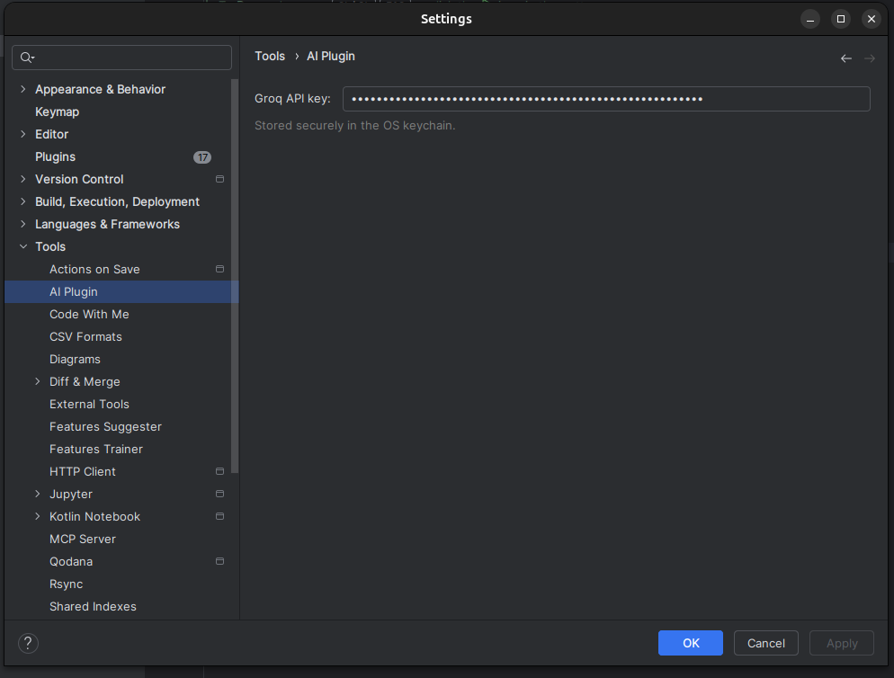
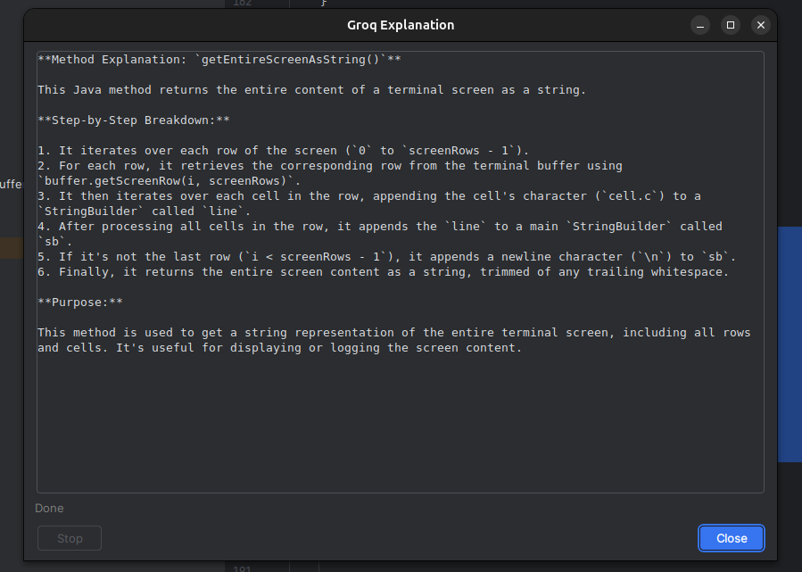
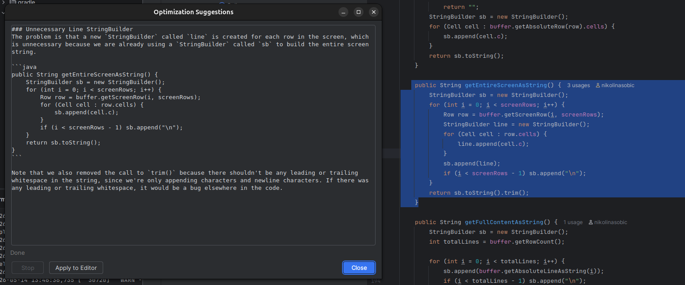
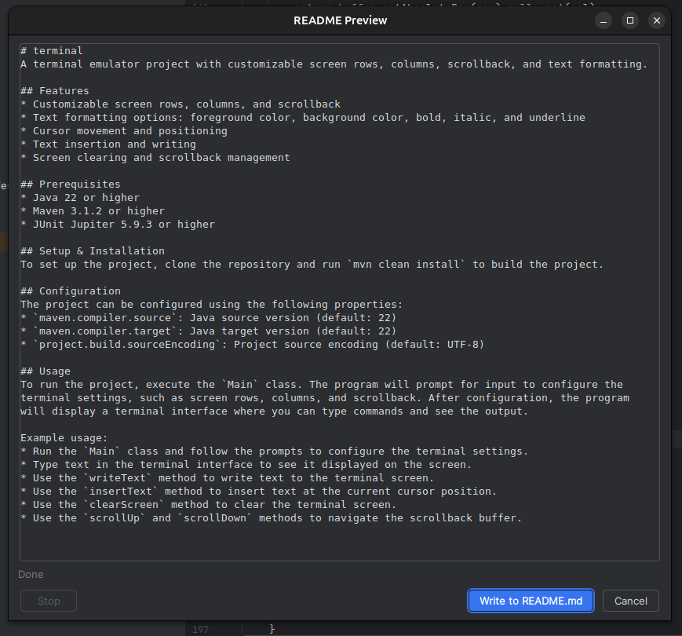

#AI Intelij Plugin

## Overview

This project represents an AI-based plugin for IntelliJ. Groq was used. The plugin supports three features:

1. Code explanation
2. Optimization suggestions
3. README generation

## Setup and Build Instructions

### Clone repository
You can clone the project using either SSH or HTTPS:
#### ssh
```bash
git clone git@github.com:nikolinasobic/AI_plugin.git
```

#### https
```bash
git clone https://github.com/nikolinasobic/AI_plugin.git
```
##### After cloning
```bash
cd AI_plugin
```

### Build and Run

```bash
./gradlew build
./gradlew run
```

At this point, you can open a project in which you want to use the plugin. 
The first step is to configure the API key. 
Navigate to Settings → Tools → AI Plugin. 
You can generate your key at [Groq Console](https://console.groq.com/authenticate?stytch_redirect_type=login).


    


After that, the plugin is ready to use!

The “Generate README” feature can be found under Tools → Generate README, while “Explain Code” and “Suggest Optimizations” become available after right-clicking on the selected text. “Suggest Optimizations” and “Explain Code” are grouped under AI Assistant.


## Examples

 
    

 
    

 
    

